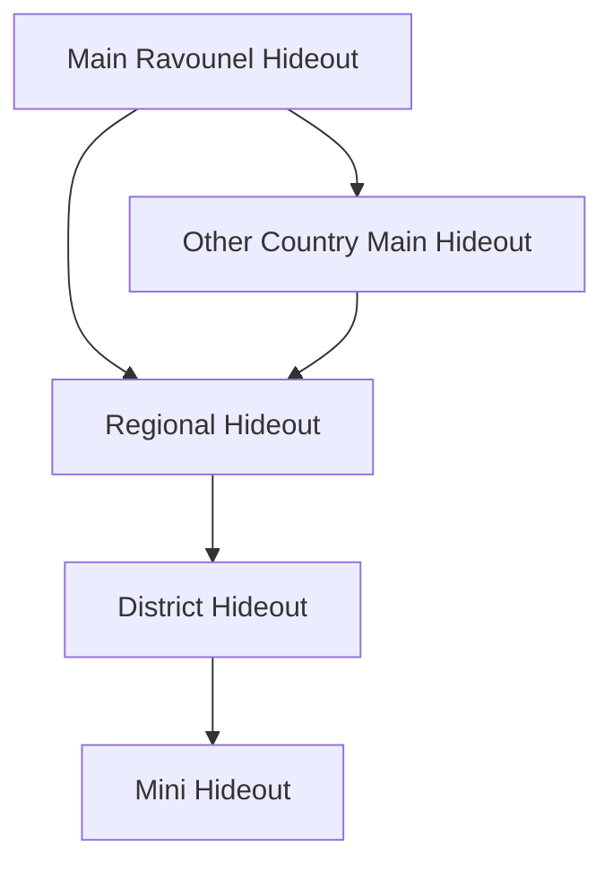

```mermaid
flowchart TB

A["Main Ravounel Hideout"]
B["Other Country Main Hideout"]
C[Regional Hideout]
D[District Hideout]
E[Mini Hideout]

class A,B,C,D,E internal-link

A --> C
A --> B
	B --> C
		C --> D
		    D --> E
```
